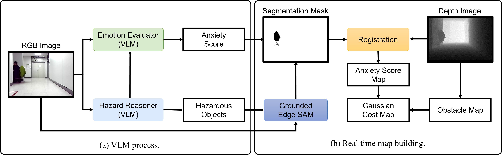
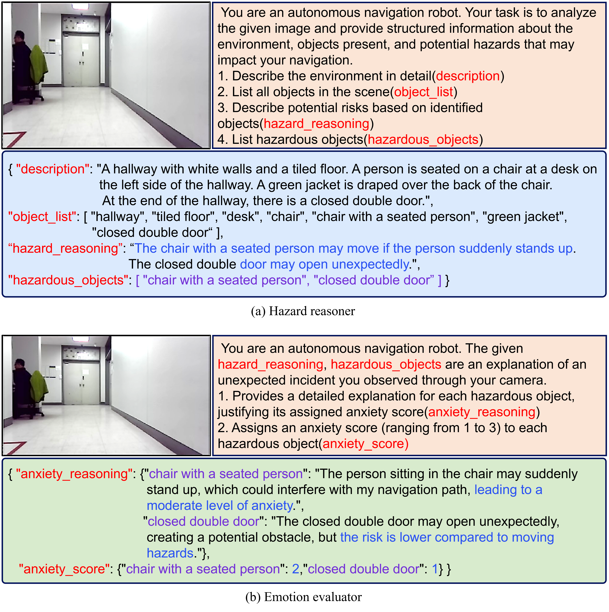
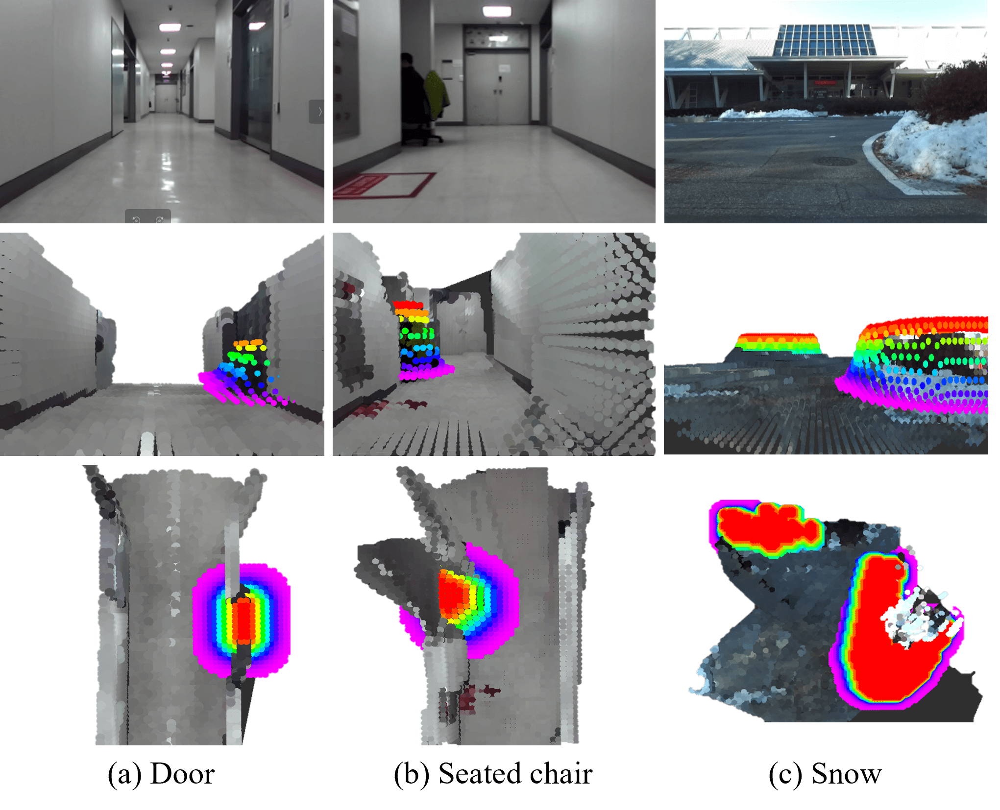
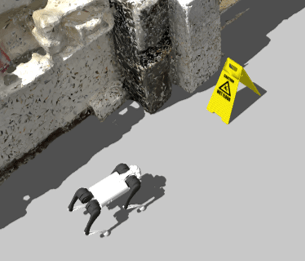
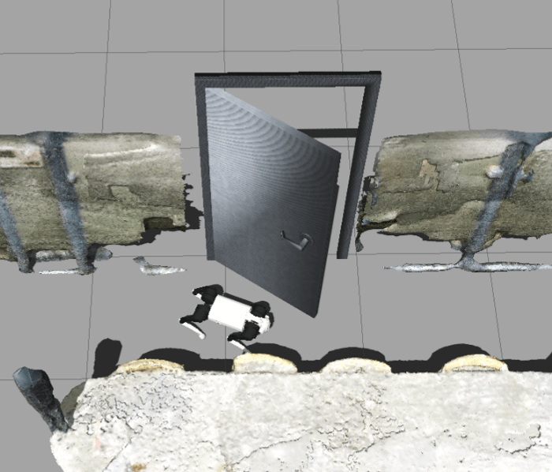
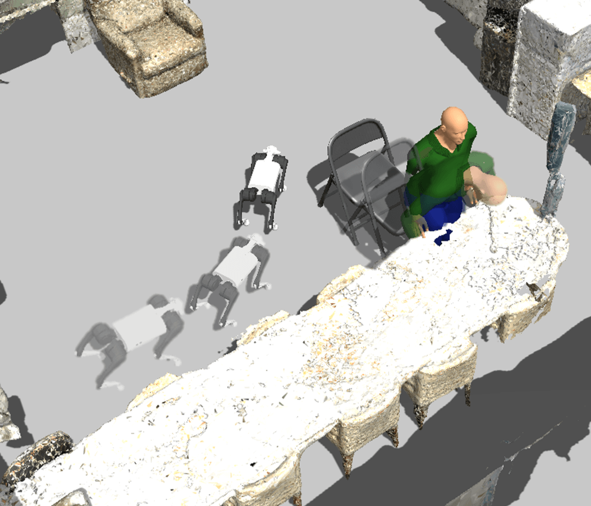
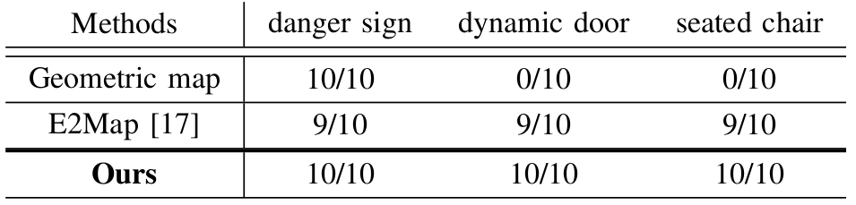
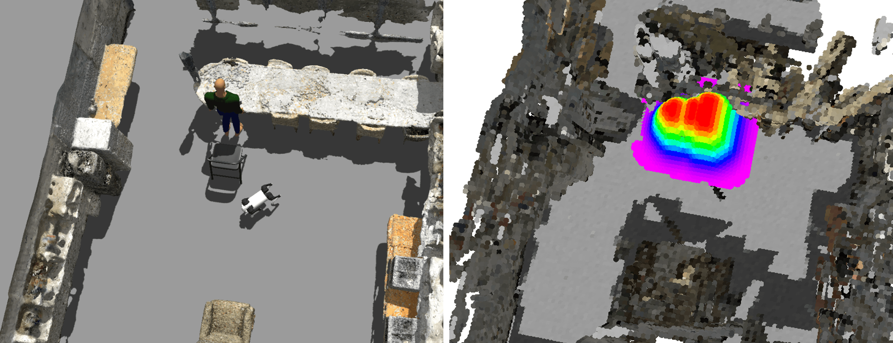

# Language as Cost: Proactive Hazard Mapping using VLM for Robot Navigation

[](http://iros25.org/)
[](https://en.snu.ac.kr/)

**Authors:** Mintaek Oh, Chan Kim and Seong-Woo Kim  
**Affiliation:** Seoul National University

## Abstract

Robots operating in human-centric or hazardous environments must proactively anticipate and mitigate dangers beyond basic obstacle detection. Traditional navigation systems often depend on static maps, which struggle to account for dynamic risks, such as a person emerging from a suddenly opened door. As a result, these systems tend to be reactive rather than anticipatory when handling dynamic hazards.

Recent advancements in pre-trained large language models and vision-language models (VLMs) present new opportunities for proactive hazard avoidance. In this work, we propose a zero-shot language-as-cost mapping framework that leverages VLMs to interpret visual scenes, assess potential dynamic risks, and assign risk-aware navigation costs preemptively, enabling robots to anticipate hazards before they materialize.

By integrating this language-based cost map with a geometric obstacle map, the robot not only identifies existing obstacles but also anticipates and proactively plans around potential hazards arising from environmental dynamics. Experiments in simulated and diverse dynamic environments demonstrate that the proposed method significantly improves navigation success rates and reduces hazard encounters compared to reactive baseline planners.

## System Architecture

Our system architecture consists of two main components: the hazard reasoning module and the cost map generation module.


*Fig. 1: System architecture. (a) The hazard reasoner describes the scene from the robot's viewpoint, identifying potentially hazardous situations and objects. The emotion evaluator then computes the anxiety score of hazardous objects based on the hazard reasoner's output and the robot's viewpoint image. (b) A real-time Gaussian map is generated to reflect potential hazards. The hazardous objects identified by the hazard reasoner are segmented using a zero-shot segmentation model to extract masks, which are combined with the anxiety scores to create an anxiety score map. This map is then integrated with the obstacle map to generate the Gaussian cost map.*

## VLM Processing Pipeline

Our approach leverages Vision-Language Models (VLMs) to interpret the visual scene and assess potential hazards:


*Fig. 2: Each top box is the VLM's input, and the bottom box is the output. The orange box represents the VLM's system prompt. The blue box is the output of (a) hazard reasoner, and the green box is the output of (b) emotion evaluator. All outputs are in JSON format.*


## Results

### Offline Dataset

<div align="center">
  <a href="videos/LaC_video.mp4">
    
  </a>
</div>

*Real-time generated Gaussian map using the proposed methodology. Potential risks are inferred from each image without direct experience, and an anxiety score is pre-computed using a VLM to update the cost of the map. The anxiety score determines how much the robot should avoid certain areas during navigation.*


*Fig. 3: Real-World Offline Data Map Building. The first row displays the RGB images from the robot's perspective. The second row visualizes the cost map corresponding to the same viewpoint as the first row. The third row presents the bird's-eye view (BEV) of the Gaussian map being generated in real-time. (a) represents the cost visualization of the potential hazard associated with a door in the indoor environment. (b) shows the cost representation of the potential hazard when a person is seated on a chair in the indoor environment. (c) illustrates the cost representation of the potential hazard on a snowy surface.*

Our approach successfully identifies potential hazards and generates appropriate cost maps to guide robot navigation.


## Simulation Experiment

### Experimental Scenarios

We evaluated our approach in three different scenarios to demonstrate its effectiveness in various environments:

<div align="center">
  
  
  
</div>

*Fig. 4: Three experimental scenarios: (left) danger sign scenario, (middle) dynamic door scenario, and (right) seated chair scenario.*
Our approach demonstrates significant improvements in navigation success rates and hazard avoidance compared to baseline methods:


*Fig. 5: Quantitative Results in Simulated Environment.*


*Fig. 6: Qualitative result of the seated chair scenario. The robot inferred the chair with a seated person as a potential hazardous object and added costs to the surrounding area, allowing it to navigate safely without collisions.*


## Code

The implementation code will be made available upon acceptance of the paper.

## Citation

If you find our work useful in your research, please consider citing:

```bibtex
@inproceedings{oh2025language,
  title={Language as Cost: Proactive Hazard Mapping using VLM for Robot Navigation},
  author={Oh, Mintaek and Kim, Chan and Kim, Seong-Woo},
  booktitle={IEEE/RSJ International Conference on Intelligent Robots and Systems (IROS)},
  year={2025},
  note={Under Review}
}
```

## Contact

For any questions or inquiries about this work, please contact:
- Mintaek Oh - [mintaek@snu.ac.kr]