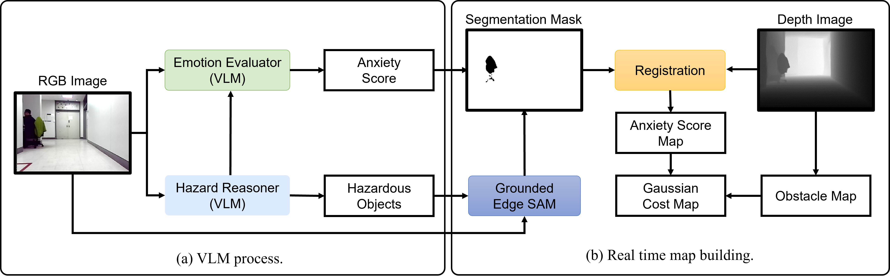
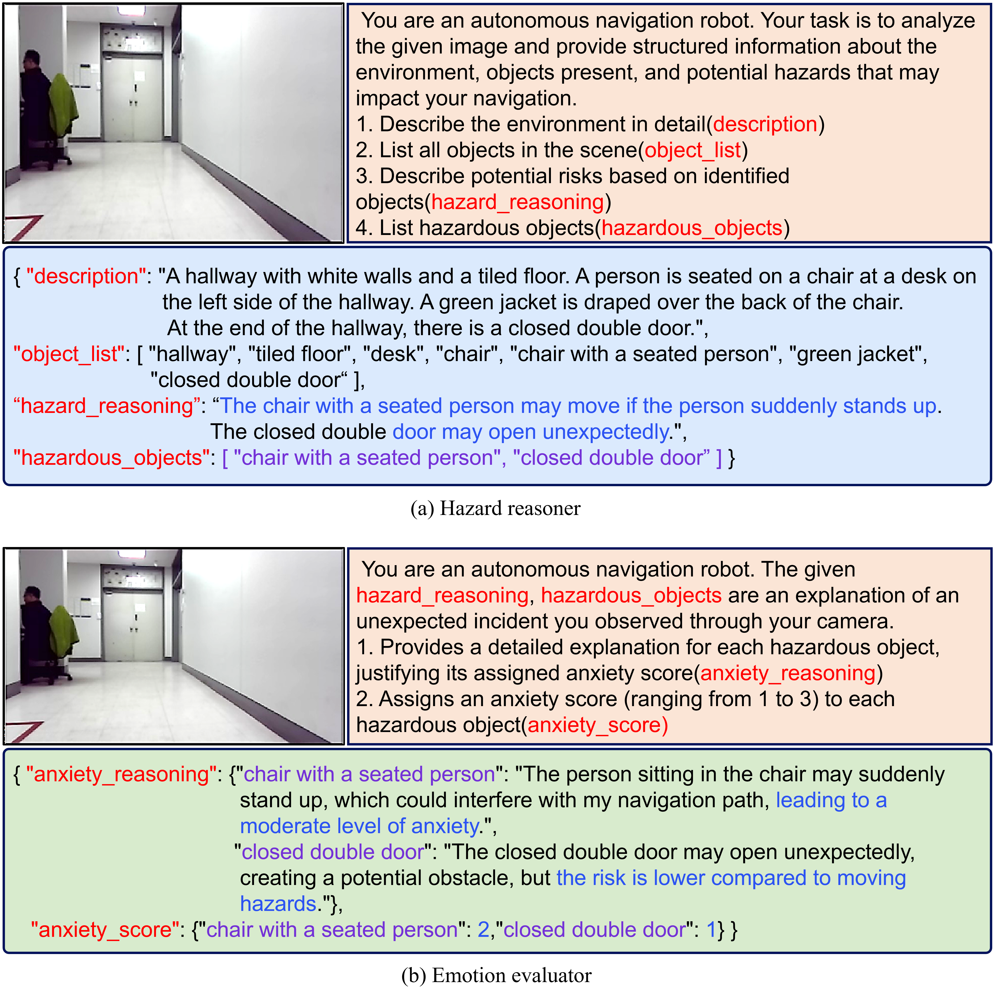

# Language as Cost: Proactive Hazard Mapping using VLM for Robot Navigation

[](http://iros25.org/)
[](https://en.snu.ac.kr/)

**Authors:** Mintaek Oh, Chan Kim, Seung-Woo Seo and Seong-Woo Kim  
**Affiliation:** Seoul National University

## Demo Video

<div align="center">
  <a href="videos/LaC_video.mp4">
    
  </a>
</div>

*Click on the GIF to view the full video.*

LaC is a **hazard-aware robot navigation** pipeline that converts **natural-language risk understanding** into a **real-time traversability cost map**. It uses **Vision-Language Models (VLMs)** to reason about hazards, assigns **anxiety scores** to hazardous objects, localizes them with **zero-shot segmentation**, and builds a **Gaussian cost map** fused with an obstacle map for safer path planning.

## Key Idea

Instead of treating the world as only *free space vs. obstacles*, LaC models **hazard severity** and its **spatial influence** as a continuous cost field derived from language-based reasoning—so the robot can proactively avoid risky areas (e.g., wet floors, doors that may open, narrow passages near humans) even when they are not strict obstacles.

## System Overview



### 1) Hazard Reasoner (VLM)
- Input: robot RGB view image `I_t` + hazard reasoning prompt `p_hd`
- Output: structured JSON `J_t` containing:
  - scene description
  - object list
  - hazard reasoning `R_t`
  - hazardous objects list `L_t`

### 2) Emotion Evaluator (VLM)
- Input: hazard reasoning `R_t`, hazardous object list `L_t`, image `I_t`, system prompt `p_ee`
- Output: anxiety score per hazard object (scale **1–3**)
  - higher score → higher cost around the object and wider Gaussian spread

### 3) Language-based Zero-shot Segmentation
- Model: **Grounded Edge SAM**
- Input: current RGB image `I_{t+k}` + latest hazard list `L_t`
- Output: hazard masks `M_{t+k}` at higher frequency than VLM inference (keeps localization responsive)

### 4) Anxiety Score Map → Gaussian Cost Map
- Combine hazard masks with depth to project hazards into a **top-down grid**
- Build an initial **anxiety score map** with discrete scores `{0,1,2,3}`
- Propagate each hazard cell to neighbors with a **2D Gaussian**
  - anxiety affects covariance (higher anxiety → broader influence)

### 5) Max-fusion with Obstacle Map
- Fuse the continuous hazard cost map with the obstacle/occupancy map using **max**
- Output: final navigation cost map `M_Gaussian ∈ [0, 1]`
  - `1` indicates impassable (obstacle or extremely risky)
  - lower values indicate lower risk

## VLM Processing Pipeline

Our approach leverages Vision-Language Models (VLMs) to interpret the visual scene and assess potential hazards. The prompts used for the Hazard Reasoner and Emotion Evaluator can be found in `src/vlm_pipeline/prompt`:



## Features

- **Proactive hazard avoidance** beyond geometric obstacles
- **Severity-aware continuous costs** via Gaussian propagation
- **Real-time operation** with asynchronous VLM reasoning + fast segmentation updates
- **Interpretable outputs** (structured JSON + explicit hazard reasoning)
- **Planner-friendly output**: a standard grid cost map in `[0,1]`

## Requirements

- **ROS**: ROS1 Noetic (Ubuntu 20.04)
- **GPU**: NVIDIA GPU with CUDA support (for GroundingDINO and EdgeSAM)
- **Docker**: Docker with NVIDIA Container Runtime
- **API Key**: OpenAI API key for VLM inference

## Components

- **Hazard Reasoner**: GPT-4o
- **Emotion Evaluator**: GPT-4o-mini
- **Zero-shot Segmentation**: Grounded Edge SAM
- **Obstacle Mapping**: depth-based obstacle map or SLAM occupancy grid
- **Gaussian Map Builder**: anxiety-based Gaussian diffusion + max-fusion

## Output

A **Gaussian hazard cost map** `M_Gaussian ∈ [0,1]` that can be directly used by navigation stacks as a risk-aware cost layer.

## System Architecture

```
RGB Image
    |
    v
[Hazard Reasoner]  (GPT-4o)
    |
    +--> Hazardous objects + Hazard reasoning
    |
    v
[Emotion Evaluator]  (GPT-4o-mini)
    |
    +--> Anxiety scores (1-3 per object)
    |
    v
[Grounded-Edge-SAM]  (GroundingDINO + EdgeSAM)
    |
    +--> Segmentation masks with anxiety encoding
    |
    v
[Gaussian Map Builder]  (C++ node)
    |
    +--> Obstacle map (from depth)
    +--> Anxiety cost map (from segmentation + depth)
    +--> Final fused occupancy grid (max-fusion)
```

## Prerequisites

- Docker with NVIDIA GPU support
- An OpenAI API key (for GPT-4o and GPT-4o-mini)

## Installation

### 1. Clone the Repository

```bash
git clone https://github.com/Taekmino/LaC.git
cd LaC/catkin_ws
```

### 2. Set Up Environment Variables

Create a `.env` file in the repository root (this file is git-ignored):

```bash
# .env
OPENAI_API_KEY=your_openai_api_key_here

# Optional: LangChain tracing
LANGCHAIN_TRACING_V2=false
LANGCHAIN_API_KEY=
LANGCHAIN_ENDPOINT=
LANGCHAIN_PROJECT=LaC
```

### 3. Build the Docker Image

The Dockerfile automatically clones and installs [GroundingDINO](https://github.com/IDEA-Research/GroundingDINO) and [EdgeSAM](https://github.com/chongzhou96/EdgeSAM), and downloads the GroundingDINO model weights.

```bash
docker compose build
```


### 4. Download the Test Bag File

Download the test bag file and place it in the `data/` directory:

```bash
mkdir -p data
# Download from: https://drive.google.com/file/d/1V9JZOzCJMVTRNB7uSxyoCbiISyHy9b43/view?usp=drive_link
# Place the file as: data/test.bag
```

## Running

### Start the Docker Container

```bash
docker compose up -d
docker compose exec lac bash
```

### Inside the Container

**Terminal 1** Launch all nodes:

```bash
source /home/appuser/LaC/catkin_ws/devel/setup.bash
roslaunch gaussian_map lac.launch
```

**Terminal 2** — Play the test bag file:

```bash
rosbag play /home/appuser/LaC/catkin_ws/data/test.bag
```

RViz launches automatically with the project config. To visualize the cost map, disable the **PointCloud2** display and enable the **Map (final_cost_grid)** display in the Displays panel.

## Integration

To use the LaC cost map on a robot, subscribe to:

| Topic | Type | Description |
|-------|------|-------------|
| `/cost_map/final_cost_grid` | `nav_msgs/OccupancyGrid` | Gaussian-spread anxiety cost map fused with obstacle map. Cell values: `0` = free, `1–99` = anxiety cost, `100` = obstacle. Pass directly to a navigation planner as a static or rolling layer. |

## Configuration

### Launch File Arguments

Edit `lac.launch` or pass as command-line arguments:

| Parameter | Default | Description |
|-----------|---------|-------------|
| `hazard_detection_model` | `gpt-4o-2024-11-20` | VLM model for hazard reasoning |
| `emotion_evaluator_model` | `gpt-4o-mini` | VLM model for emotion evaluation |
| `sigma_method` | `0` | Gaussian sigma calculation: 0 = fixed per-level, 1 = log-based |
| `T_param` | `1.0` | Denominator T for log-based sigma method |
| `sigma_k_1` | `0.15` | Base Gaussian sigma for anxiety score 1 (m) |
| `sigma_k_2` | `0.20` | Base Gaussian sigma for anxiety score 2 (m) |
| `sigma_k_3` | `0.25` | Base Gaussian sigma for anxiety score 3 (m) |

### Cost Map Node Parameters

| Parameter | Default | Description |
|-----------|---------|-------------|
| `z_max_threshold` | 1.3 | Maximum z-height for obstacle detection (m) |
| `z_min_threshold` | -0.1 | Minimum z-height for obstacle detection (m) |
| `max_cost_depth_threshold` | 3.3 | Maximum depth for cost map generation (m) |
| `grid_resolution` | 0.05 | Grid cell size (m) |
| `sliding_window_size` | 4 | Number of frames for temporal consistency |
| `depth_factor` | 1000.0 | Depth image scale factor (mm to m) |


## Project Structure

```
catkin_ws/
├── Dockerfile
├── docker-compose.yml
├── README.md
├── .gitignore
├── videos/
├── images/
├── data/                          # Place test.bag here (git-ignored)
└── src/
    ├── gaussian_map/              # C++ package: depth processing and mapping
    │   ├── CMakeLists.txt
    │   ├── package.xml
    │   ├── launch/
    │   │   ├── lac.launch         # Main launch file (all nodes)
    │   └── src/
    │       ├── cost_map.cpp       # 2D obstacle + Gaussian cost map
    │       ├── depth_rgb_map_node.cpp  # 3D voxel RGB-D mapping
    └── vlm_pipeline/              # Python package: VLM + segmentation
        ├── CMakeLists.txt
        ├── package.xml
        ├── scripts/
        │   ├── hazard_detection.py    # VLM hazard reasoning + emotion evaluation
        │   └── grounded_sam_node.py   # GroundingDINO + EdgeSAM segmentation
        └── prompt/
            ├── hd_system_prompt_template.txt
            ├── hd_user_prompt.txt
            ├── ee_system_prompt_template.txt
            └── ee_user_prompt.txt
```

## Citation

If you use this work in your research, please cite:

```bibtex
@inproceedings{oh2025language,
  title={Language as Cost: Proactive Hazard Mapping using VLM for Robot Navigation},
  author={Oh, Mintaek and Kim, Chan and Seo, Seung-Woo and Kim, Seong-Woo},
  booktitle={2025 IEEE/RSJ International Conference on Intelligent Robots and Systems (IROS)},
  pages={21543--21550},
  year={2025},
  organization={IEEE}
}
```

## License

This project is licensed under the MIT License.

## Contact

For any questions or inquiries about this work, please contact:
- Mintaek Oh - [mintaek@snu.ac.kr]